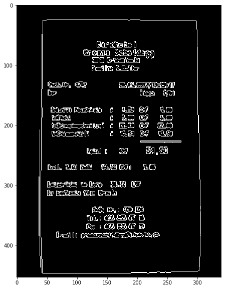

## Import the required libraries.
```python
import cv2
import numpy as np
import matplotlib.pyplot as plt
%matplotlib inline
```

### Read the image.
```python
img=cv2.imread('receipt.jpg')
img.shape
```


    (453, 340, 3)


#### Resize the image if needed.
Here i have left the image in its orignal form.
```python
#img=cv2.resize(img,(500,600))
```


```python
orig=img.copy()
```

## Convert the image into grayscale and apply blur.
Blur is applied so as to make the contour detection easy.

```python
gray = cv2.cvtColor(img, cv2.COLOR_BGR2GRAY)
gray = cv2.GaussianBlur(gray, (5, 5), 0)

```

#### Function to display the images.
```python
def display_img(img):
    fig = plt.figure(figsize=(14,10))
    ax = fig.add_subplot(111)
    ax.imshow(img,cmap='gray')
```


```python
display_img(img)
```


# Preprocessing before contour detection.  

## DETECTION USING COLOR


```python
imgHsv = cv2.cvtColor(img, cv2.COLOR_BGR2HSV);
```


```python
lower = np.array([0, 0, 180])
upper = np.array([180, 25, 255])


```


```python
bw = cv2.inRange(imgHsv, lower, upper)
```


```python
display_img(bw)
```


```python

```


```python

```

## DETECTION USING BRIGHTNESS AND CONTRAST


```python
ret,thresh2 = cv2.threshold(gray.copy(),180,255,cv2.THRESH_BINARY_INV)
```


```python
display_img(thresh2)
```


```python
thresh21=cv2.bitwise_not(thresh2)
```


```python
display_img(thresh21)
```


```python

```


```python
display_img(gray)
```


## DETECTION USING EDGES


```python
edged = cv2.Canny(gray, 75, 200)
display_img(edged)
```





## Now find the contours.
Here the contours are found using the color or HSV threshold preprocessing.
```python
contours,hierarchy = cv2.findContours(bw.copy(), cv2.RETR_LIST, cv2.CHAIN_APPROX_NONE)
```


```python
len(contours)
```


    575


## Draw the external contours that will be used to resize the useful part of the image.
```python
# Draw External Contours

# Set up empty array
external_contours = np.zeros(img.shape)

# For every entry in contours
for i in range(len(contours)):
    
    # last column in the array is -1 if an external contour (no contours inside of it)
    if hierarchy[0][i][3] == -1:
        
        # We can now draw the external contours from the list of contours
        cv2.drawContours(external_contours, contours, i, (255), -1)
```


```python
display_img(external_contours)
```

    Clipping input data to the valid range for imshow with RGB data ([0..1] for floats or [0..255] for integers).
    


```python
hierarchy
```


    array([[[  1,  -1,  -1,  -1],
            [  2,   0,  -1,  -1],
            [  3,   1,  -1,  -1],
            ...,
            [573, 571,  -1,  -1],
            [574, 572,  -1,  -1],
            [ -1, 573,  -1,  -1]]], dtype=int32)


## Find the largets contour out of the many contours found.
This is generally the outline of the document we want to scan.
```python
cnts = sorted(contours, key = cv2.contourArea, reverse = True)[:5]
```


```python
for c in cnts:
# approximate the contour
    peri = cv2.arcLength(c, True)
    approx = cv2.approxPolyDP(c, 0.02 * peri, True)
    # if our approximated contour has four points, then we
    # can assume that we have found our screen
    if len(approx) == 4:
        screenCnt = approx
        break
```


```python
0.02*peri
```


    27.753279888629915


```python
approx
```


    array([[[ 47,  26]],
    
           [[ 43, 446]],
    
           [[296, 442]],
    
           [[296,  27]]], dtype=int32)


```python
cnts
```


    [array([[[95, 24]],
     
            [[94, 25]],
     
            [[93, 25]],
     
            ...,
     
            [[98, 25]],
     
            [[97, 24]],
     
            [[96, 24]]], dtype=int32),
     array([[[165, 378]],
     
            [[166, 377]],
     
            [[167, 378]],
     
            [[167, 379]],
     
            [[167, 380]],
     
            [[167, 381]],
     
            [[167, 382]],
     
            [[167, 383]],
     
            [[167, 382]],
     
            [[167, 381]],
     
            [[167, 380]],
     
            [[168, 379]],
     
            [[169, 379]],
     
            [[170, 379]],
     
            [[171, 380]],
     
            [[172, 381]],
     
            [[173, 380]],
     
            [[174, 379]],
     
            [[175, 379]],
     
            [[176, 380]],
     
            [[177, 381]],
     
            [[178, 380]],
     
            [[179, 381]],
     
            [[179, 382]],
     
            [[179, 383]],
     
            [[180, 382]],
     
            [[179, 381]],
     
            [[178, 380]],
     
            [[179, 379]],
     
            [[180, 379]],
     
            [[181, 380]],
     
            [[182, 381]],
     
            [[182, 382]],
     
            [[182, 381]],
     
            [[183, 380]],
     
            [[184, 379]],
     
            [[183, 380]],
     
            [[182, 381]],
     
            [[181, 380]],
     
            [[181, 379]],
     
            [[182, 378]],
     
            [[183, 377]],
     
            [[184, 377]],
     
            [[185, 377]],
     
            [[186, 378]],
     
            [[187, 377]],
     
            [[188, 377]],
     
            [[189, 378]],
     
            [[189, 379]],
     
            [[190, 379]],
     
            [[191, 380]],
     
            [[192, 381]],
     
            [[192, 382]],
     
            [[192, 383]],
     
            [[192, 384]],
     
            [[191, 385]],
     
            [[190, 386]],
     
            [[189, 386]],
     
            [[188, 386]],
     
            [[187, 386]],
     
            [[186, 385]],
     
            [[187, 384]],
     
            [[186, 383]],
     
            [[186, 382]],
     
            [[186, 381]],
     
            [[186, 380]],
     
            [[186, 381]],
     
            [[186, 382]],
     
            [[186, 383]],
     
            [[186, 384]],
     
            [[186, 385]],
     
            [[185, 386]],
     
            [[184, 386]],
     
            [[183, 386]],
     
            [[182, 385]],
     
            [[182, 384]],
     
            [[182, 385]],
     
            [[182, 386]],
     
            [[181, 387]],
     
            [[180, 387]],
     
            [[179, 388]],
     
            [[178, 387]],
     
            [[177, 386]],
     
            [[178, 385]],
     
            [[179, 385]],
     
            [[180, 385]],
     
            [[179, 385]],
     
            [[178, 385]],
     
            [[177, 384]],
     
            [[177, 385]],
     
            [[177, 386]],
     
            [[176, 387]],
     
            [[175, 387]],
     
            [[174, 388]],
     
            [[173, 387]],
     
            [[172, 386]],
     
            [[173, 385]],
     
            [[174, 385]],
     
            [[175, 385]],
     
            [[174, 385]],
     
            [[173, 385]],
     
            [[172, 384]],
     
            [[171, 383]],
     
            [[170, 384]],
     
            [[169, 384]],
     
            [[170, 384]],
     
            [[171, 383]],
     
            [[172, 384]],
     
            [[172, 385]],
     
            [[171, 386]],
     
            [[170, 386]],
     
            [[169, 387]],
     
            [[168, 386]],
     
            [[167, 385]],
     
            [[166, 386]],
     
            [[165, 386]],
     
            [[164, 387]],
     
            [[163, 386]],
     
            [[162, 385]],
     
            [[161, 384]],
     
            [[161, 383]],
     
            [[161, 382]],
     
            [[162, 381]],
     
            [[163, 380]],
     
            [[164, 379]],
     
            [[165, 380]],
     
            [[165, 379]]], dtype=int32),
     array([[[111, 381]],
     
            [[112, 380]],
     
            [[113, 380]],
     
            [[114, 380]],
     
            [[115, 380]],
     
            [[116, 381]],
     
            [[117, 381]],
     
            [[118, 380]],
     
            [[119, 380]],
     
            [[120, 380]],
     
            [[121, 381]],
     
            [[122, 381]],
     
            [[123, 380]],
     
            [[124, 380]],
     
            [[125, 380]],
     
            [[126, 381]],
     
            [[125, 382]],
     
            [[124, 382]],
     
            [[125, 382]],
     
            [[126, 383]],
     
            [[127, 384]],
     
            [[127, 385]],
     
            [[126, 386]],
     
            [[125, 387]],
     
            [[124, 387]],
     
            [[123, 387]],
     
            [[122, 386]],
     
            [[121, 386]],
     
            [[120, 387]],
     
            [[119, 387]],
     
            [[118, 387]],
     
            [[117, 386]],
     
            [[116, 385]],
     
            [[116, 384]],
     
            [[116, 383]],
     
            [[115, 383]],
     
            [[114, 382]],
     
            [[114, 383]],
     
            [[113, 384]],
     
            [[114, 385]],
     
            [[113, 386]],
     
            [[112, 386]],
     
            [[111, 387]],
     
            [[110, 388]],
     
            [[109, 388]],
     
            [[108, 388]],
     
            [[107, 387]],
     
            [[106, 386]],
     
            [[107, 385]],
     
            [[108, 385]],
     
            [[109, 386]],
     
            [[109, 385]],
     
            [[108, 385]],
     
            [[107, 384]],
     
            [[108, 383]],
     
            [[109, 383]],
     
            [[110, 383]],
     
            [[111, 382]]], dtype=int32),
     array([[[206, 196]],
     
            [[207, 195]],
     
            [[208, 196]],
     
            [[209, 196]],
     
            [[210, 196]],
     
            [[211, 196]],
     
            [[212, 197]],
     
            [[212, 198]],
     
            [[212, 199]],
     
            [[213, 199]],
     
            [[212, 198]],
     
            [[213, 197]],
     
            [[214, 196]],
     
            [[215, 196]],
     
            [[216, 196]],
     
            [[217, 196]],
     
            [[218, 195]],
     
            [[219, 196]],
     
            [[220, 197]],
     
            [[219, 198]],
     
            [[218, 198]],
     
            [[217, 198]],
     
            [[216, 198]],
     
            [[216, 199]],
     
            [[217, 199]],
     
            [[218, 199]],
     
            [[219, 200]],
     
            [[218, 201]],
     
            [[217, 201]],
     
            [[216, 202]],
     
            [[217, 203]],
     
            [[217, 204]],
     
            [[216, 205]],
     
            [[215, 205]],
     
            [[214, 205]],
     
            [[213, 204]],
     
            [[213, 203]],
     
            [[213, 202]],
     
            [[212, 201]],
     
            [[212, 202]],
     
            [[212, 203]],
     
            [[212, 204]],
     
            [[211, 205]],
     
            [[210, 205]],
     
            [[209, 204]],
     
            [[208, 205]],
     
            [[207, 205]],
     
            [[206, 204]],
     
            [[207, 203]],
     
            [[208, 202]],
     
            [[209, 202]],
     
            [[209, 201]],
     
            [[209, 200]],
     
            [[209, 199]],
     
            [[208, 198]],
     
            [[207, 198]],
     
            [[207, 199]],
     
            [[207, 200]],
     
            [[207, 201]],
     
            [[207, 202]],
     
            [[207, 203]],
     
            [[206, 204]],
     
            [[205, 203]],
     
            [[204, 202]],
     
            [[204, 201]],
     
            [[204, 200]],
     
            [[204, 199]],
     
            [[205, 198]],
     
            [[205, 197]]], dtype=int32),
     array([[[171, 239]],
     
            [[172, 238]],
     
            [[173, 238]],
     
            [[174, 238]],
     
            [[175, 239]],
     
            [[174, 240]],
     
            [[173, 240]],
     
            [[173, 241]],
     
            [[173, 242]],
     
            [[173, 243]],
     
            [[173, 244]],
     
            [[173, 245]],
     
            [[174, 245]],
     
            [[175, 244]],
     
            [[175, 243]],
     
            [[176, 242]],
     
            [[175, 241]],
     
            [[174, 240]],
     
            [[175, 239]],
     
            [[176, 239]],
     
            [[177, 238]],
     
            [[178, 239]],
     
            [[178, 240]],
     
            [[178, 241]],
     
            [[179, 241]],
     
            [[179, 240]],
     
            [[179, 239]],
     
            [[180, 238]],
     
            [[181, 239]],
     
            [[182, 238]],
     
            [[183, 238]],
     
            [[184, 238]],
     
            [[185, 238]],
     
            [[186, 239]],
     
            [[185, 240]],
     
            [[184, 240]],
     
            [[183, 240]],
     
            [[183, 241]],
     
            [[184, 241]],
     
            [[185, 242]],
     
            [[185, 243]],
     
            [[184, 244]],
     
            [[183, 243]],
     
            [[183, 244]],
     
            [[183, 245]],
     
            [[183, 246]],
     
            [[182, 247]],
     
            [[181, 247]],
     
            [[180, 247]],
     
            [[179, 246]],
     
            [[179, 245]],
     
            [[179, 244]],
     
            [[178, 243]],
     
            [[178, 244]],
     
            [[178, 245]],
     
            [[178, 246]],
     
            [[177, 247]],
     
            [[176, 247]],
     
            [[175, 247]],
     
            [[174, 247]],
     
            [[173, 247]],
     
            [[172, 247]],
     
            [[171, 246]],
     
            [[171, 245]],
     
            [[170, 244]],
     
            [[170, 243]],
     
            [[170, 242]],
     
            [[170, 241]],
     
            [[171, 240]]], dtype=int32)]


```python
len(cnts)
```


    5


# Draw the acquired contours.
```python
cv2.drawContours(img, [screenCnt], -1, (0, 255, 0), 2)
```


    array([[[ 20,  66, 144],
            [ 33,  79, 157],
            [ 29,  74, 155],
            ...,
            [ 24,  66, 131],
            [ 22,  64, 129],
            [ 23,  65, 130]],
    
           [[ 22,  68, 146],
            [ 32,  78, 156],
            [ 31,  76, 157],
            ...,
            [ 25,  66, 135],
            [ 23,  64, 133],
            [ 24,  66, 133]],
    
           [[ 26,  72, 150],
            [ 30,  76, 154],
            [ 33,  78, 159],
            ...,
            [ 24,  64, 139],
            [ 23,  63, 138],
            [ 24,  65, 138]],
    
           ...,
    
           [[ 36,  85, 163],
            [ 39,  88, 166],
            [ 38,  87, 165],
            ...,
            [ 40,  80, 152],
            [ 40,  85, 153],
            [ 33,  80, 148]],
    
           [[ 39,  88, 166],
            [ 40,  89, 167],
            [ 37,  86, 164],
            ...,
            [ 40,  80, 152],
            [ 38,  83, 151],
            [ 32,  79, 147]],
    
           [[ 40,  89, 167],
            [ 39,  88, 166],
            [ 36,  85, 163],
            ...,
            [ 33,  75, 144],
            [ 34,  79, 147],
            [ 31,  78, 146]]], dtype=uint8)


```python
display_img(img)
```


# FOUR POINT TRANSFORM
This is done to resize and align the useful part of the image.

```python
def order_points(pts):
    # initialzie a list of coordinates that will be ordered
    # such that the first entry in the list is the top-left,
    # the second entry is the top-right, the third is the
    # bottom-right, and the fourth is the bottom-left
    rect = np.zeros((4, 2), dtype = "float32")
    # the top-left point will have the smallest sum, whereas
    # the bottom-right point will have the largest sum
    s = pts.sum(axis = 1)
    rect[0] = pts[np.argmin(s)]
    rect[2] = pts[np.argmax(s)]
    # now, compute the difference between the points, the
    # top-right point will have the smallest difference,
    # whereas the bottom-left will have the largest difference
    diff = np.diff(pts, axis = 1)
    rect[1] = pts[np.argmin(diff)]
    rect[3] = pts[np.argmax(diff)]
    # return the ordered coordinates
    return rect
```


```python
def four_point_transform(image, pts):
# obtain a consistent order of the points and unpack them
# individually
    rect = order_points(pts)
    (tl, tr, br, bl) = rect
# compute the width of the new image, which will be the
# maximum distance between bottom-right and bottom-left
# x-coordiates or the top-right and top-left x-coordinates
    widthA = np.sqrt(((br[0] - bl[0]) ** 2) + ((br[1] - bl[1]) ** 2))
    widthB = np.sqrt(((tr[0] - tl[0]) ** 2) + ((tr[1] - tl[1]) ** 2))
    maxWidth = max(int(widthA), int(widthB))
# compute the height of the new image, which will be the
# maximum distance between the top-right and bottom-right
# y-coordinates or the top-left and bottom-left y-coordinates
    heightA = np.sqrt(((tr[0] - br[0]) ** 2) + ((tr[1] - br[1]) ** 2))
    heightB = np.sqrt(((tl[0] - bl[0]) ** 2) + ((tl[1] - bl[1]) ** 2))
    maxHeight = max(int(heightA), int(heightB))
# now that we have the dimensions of the new image, construct
# the set of destination points to obtain a "birds eye view",
# (i.e. top-down view) of the image, again specifying points
# in the top-left, top-right, bottom-right, and bottom-left
# order
    dst = np.array([
        [0, 0],
        [maxWidth - 1, 0],
        [maxWidth - 1, maxHeight - 1],
        [0, maxHeight - 1]], dtype = "float32")
# compute the perspective transform matrix and then apply it
    M = cv2.getPerspectiveTransform(rect, dst)
    warped = cv2.warpPerspective(image, M, (maxWidth, maxHeight))
# return the warped image
    return warped
```


```python
warped = four_point_transform(orig, screenCnt.reshape(4,2) )
```


```python
display_img(warped)
```


```python
warped.shape
```


    (420, 253, 3)


# Apply threshold to highlight the text and information.
```python
warped = cv2.cvtColor(warped, cv2.COLOR_BGR2GRAY)
final = cv2.adaptiveThreshold(warped.copy(),50,cv2.ADAPTIVE_THRESH_GAUSSIAN_C, cv2.THRESH_BINARY,11,4)
display_img(final)
```


```python

```


